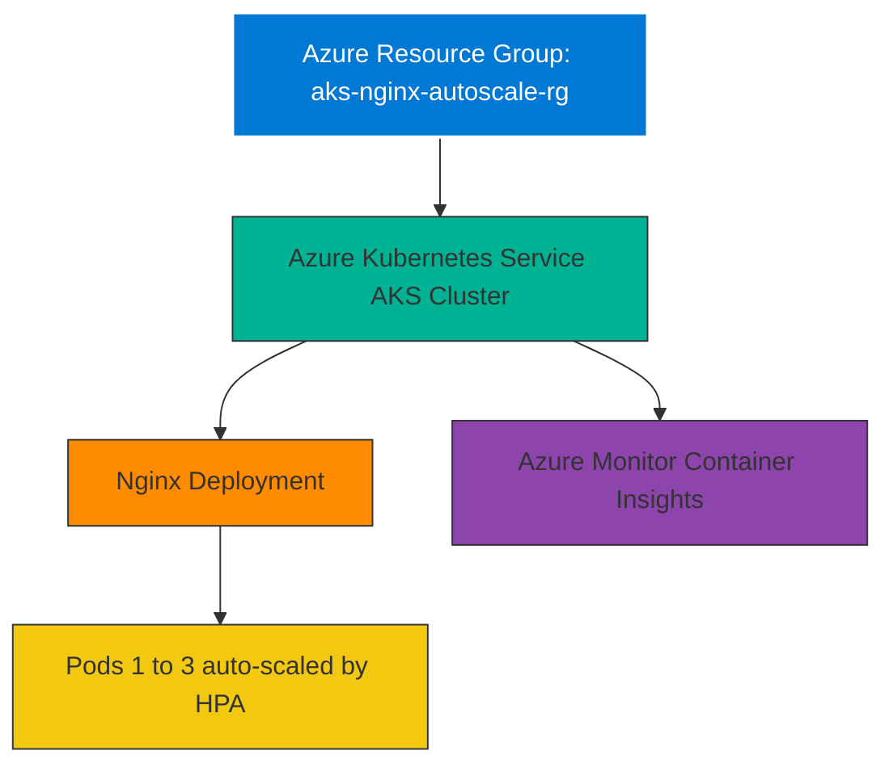

# AKS Nginx Autoscale Demo

## 🚀 Project Overview
This project demonstrates deploying a **Nginx web server** on **Azure Kubernetes Service (AKS)** with **Horizontal Pod Autoscaling (HPA)**.  
It showcases my hands-on skills in **Azure, Kubernetes, Linux, DevOps, and container scaling**.

---

## 🖼 Architecture Diagram

🛠 Key Skills Demonstrated

    - Deploying AKS clusters using Azure CLI / PowerShell
    - Writing Kubernetes manifests (Deployment, Service, HPA)
    - Autoscaling pods based on CPU usage
    - Monitoring clusters with Azure Monitor / Container Insights
    - Linux CLI and container management

📸 Screenshots

    - AKS Cluster in Azure Portal: screenshots/aks-portal.png
    - Nginx Pods Running: screenshots/kubectl-pods.png
    - HPA Scaling: screenshots/kubectl-hpa.png
    - Nginx Page in Browser: screenshots/nginx-browser.png

📌 Notes for Recruiters
    This project demonstrates my ability to:
        - Automate deployments on Azure
        - Manage Kubernetes workloads and scaling
        - Monitor cloud infrastructure efficiently
        - Apply DevOps best practices in real-world scenarios

#Azure #AKS #Kubernetes #Nginx #DevOps #Autoscaling #CloudComputing #AzureMonitor